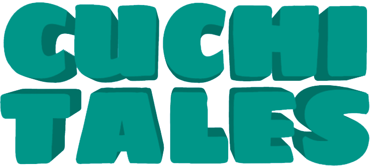
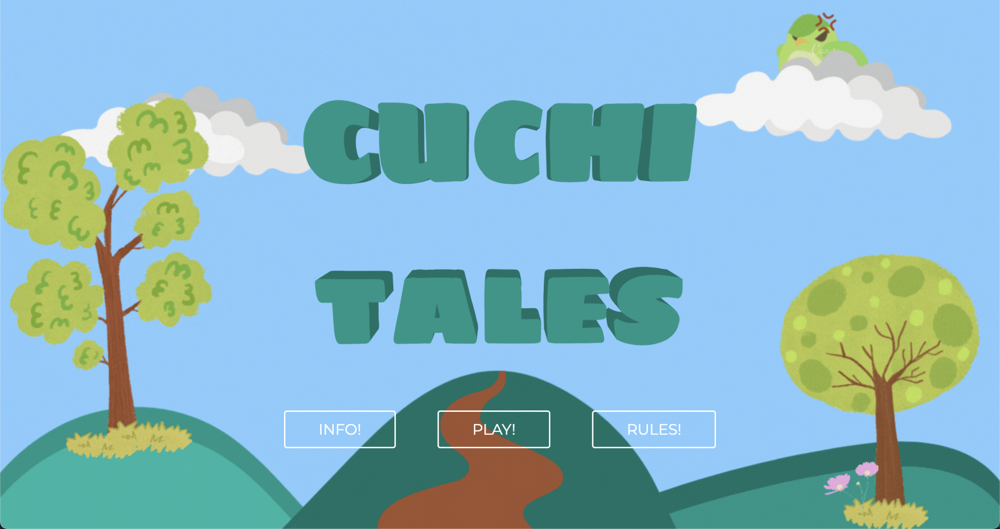
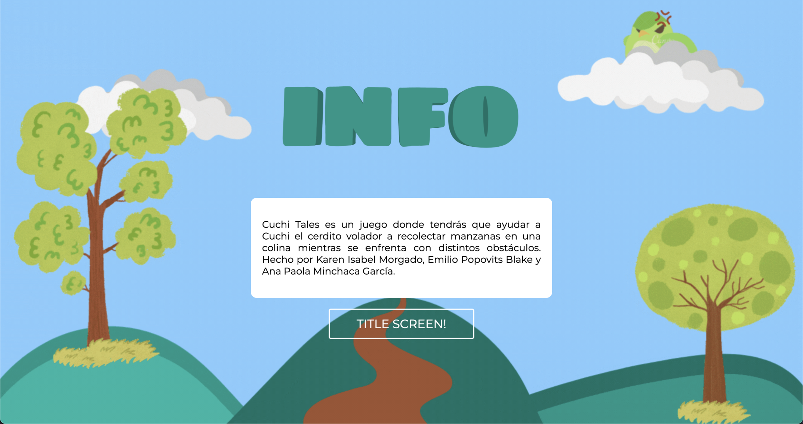
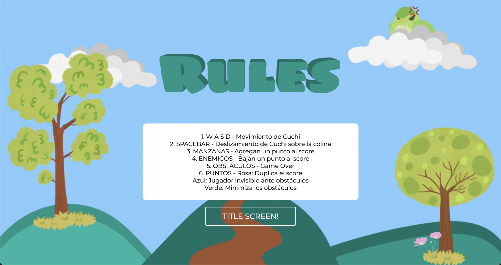
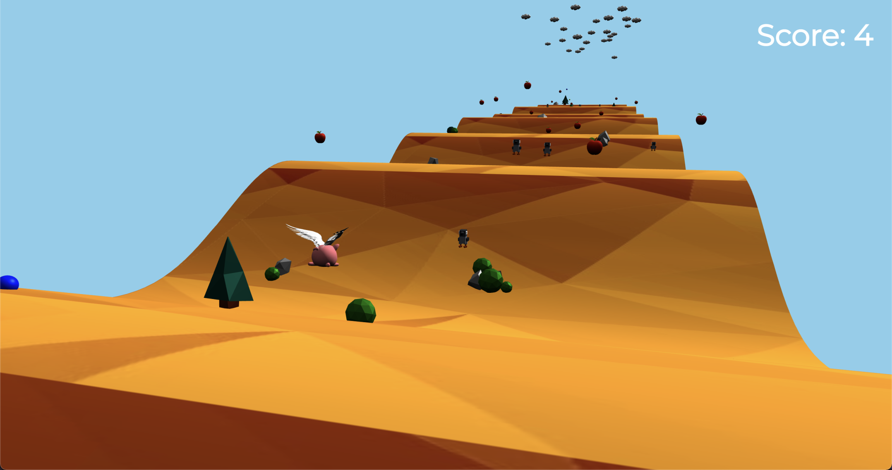
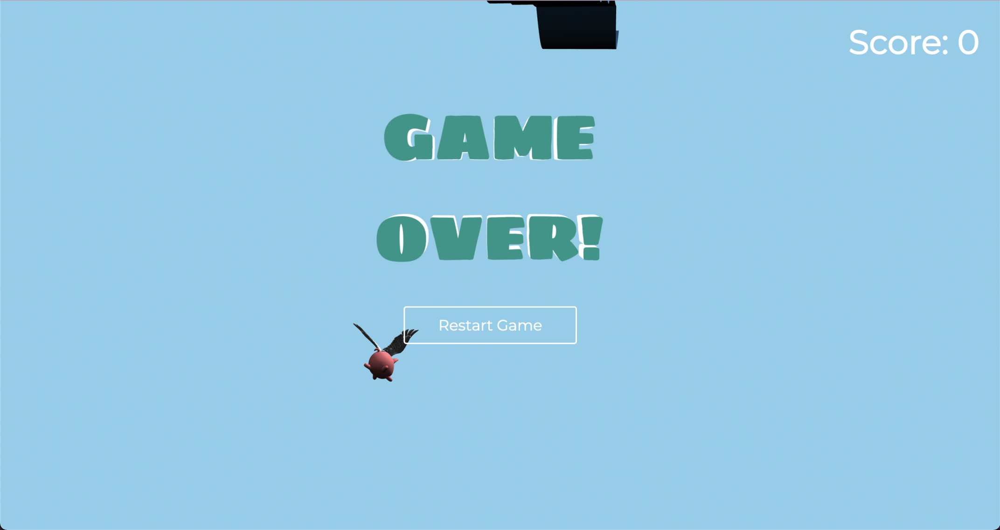

<!-- Improved compatibility of back to top link: See: https://github.com/othneildrew/Best-README-Template/pull/73 -->
<a name="readme-top"></a>
<!--
*** Thanks for checking out the Best-README-Template. If you have a suggestion
*** that would make this better, please fork the repo and create a pull request
*** or simply open an issue with the tag "enhancement".
*** Don't forget to give the project a star!
*** Thanks again! Now go create something AMAZING! :D
-->


<!-- PROJECT SHIELDS -->
<!--
*** I'm using markdown "reference style" links for readability.
*** Reference links are enclosed in brackets [ ] instead of parentheses ( ).
*** See the bottom of this document for the declaration of the reference variables
*** for contributors-url, forks-url, etc. This is an optional, concise syntax you may use.
*** https://www.markdownguide.org/basic-syntax/#reference-style-links
-->
[![Portfolio][moreinfo-shield]][moreinfo-url]
[![Contributors][contributors-shield]][contributors-url]
[![LinkedIn][linkedin-shield]][linkedin-url]


<!-- PROJECT LOGO -->
<br />
<div align="center">
  <a href="https://github.com/empobla/CuchiTales">
    
  </a>

<h3 align="center">Cuchi Tales</h3>

  <p align="center">
    A game inspired by Tiny Wings, developed in Three.js.
    <br />
    <br />
    ·
    <a href="https://cuchitales.demo.emilioppv.com">View Demo</a>
    ·
  </p>
</div>


<!-- TABLE OF CONTENTS -->
<details>
  <summary>Table of Contents</summary>
  <ol>
    <li>
      <a href="#about-the-project">About The Project</a>
      <ul>
        <li><a href="#built-with">Built With</a></li>
      </ul>
    </li>
    <li>
      <a href="#getting-started">Getting Started</a>
      <ul>
        <li><a href="#prerequisites">Prerequisites</a></li>
        <li><a href="#installation">Installation</a></li>
      </ul>
    </li>
    <li><a href="#modules">Modules</a></li>
    <li><a href="#assets">Assets</a></li>
    <li><a href="#screenshots">Screenshots</a></li>
    <li><a href="#contact">Contact</a></li>
  </ol>
</details>


<!-- ABOUT THE PROJECT -->
## About The Project

[![Cuchi Tales Screen Shot][product-screenshot]](https://cuchitales.demo.emilioppv.com)

**Cuchi Tales** is a game where the player will have to control Cuchi, a flying pig who will have to glide over hills while dodging obstacles and eating apples to gain points. There will be enemies on his way that will lower his score and clouds that will end his journey. This game was inspired by Tiny Wings.

In his journey, Cuchi will find the following powerups that will help him in his way:

* **Pink** - Cuchi's score doubles
* **Blue** - Cuchi becomes invisible to enemies and obstacles
* **Green** - Enemies and obstacles become small

In the main menu screen, you can find three buttons:

* **Info** - Character's story and the names of the authors
* **Play** - Starts the game
* **Rules** - The game's rules and controls

The player starts his journey on the first island, which has a beginner difficulty. This island serves as a "tutorial" so that the player can get familiarized with the game's mechanics. After each map, the player must jump to reach the following island, which will incrementally get harder due to the terrain, obstacles, and amount of available points. If the player falls off the map, the game ends and the game must be re-start.

How many islands can you help Cuchi traverse?

<p align="right">(<a href="#readme-top">back to top</a>)</p>


### Built With

[![JavaScript][JavaScript]][JavaScript-url]
[![Three.js][Three.js]][Three-url]
[![Cannon-es][Cannon-es]][Cannon-url]
[![ZText.js][ZText.js]][ZText-url]

<p align="right">(<a href="#readme-top">back to top</a>)</p>


<!-- GETTING STARTED -->
## Getting Started

To get a local copy up and running follow these simple example steps.

### Prerequisites

This game requires a server to run locally. You can initialize the server with any of the following:
* VSCode Live Server
* VSCode Live Preview
* Node.js

### Installation

1. Clone the repo
   ```sh
   git clone https://github.com/empobla/CuchiTales.git
   ```
2. Serve the following in a server:
   * `TinyWings/index.html`
   * `TinyWings/base_scene.html`
   * `TinyWings/info_scene.html`
   * `TinyWings/control_scene.html`

<p align="right">(<a href="#readme-top">back to top</a>)</p>


<!-- MODULES -->
## Modules

The following modules are provided, which help with the game's mechanics:

* **Audio Manager** - Controls audio and music that can be heard during gameplay.
* **Game Manager** - Handles the game's core mechanics, like generating assets, checking collisions, generating new islands, culling unused assets, etc.
* **Player Control** - Handles the player's movement and physics.
* **Terrain Generator** - Handles terrain generation, adds texture to the terrain, adds environments assets to terrain, adds clouds to terrains, and also adds enemies, points, and powerups to the terrain.
* **Third Person Camera** - Handles spring-like third-person camera movement.
* **Loaders** - Handles asset and objectloading.

<p align="right">(<a href="#readme-top">back to top</a>)</p>


<!-- ASSETS -->
## Assets

The following assets are provided:
* Cuchi
* Apples
* Clouds
* Enemy Bird
* Powerups
* Stones
* Bushes
* Trees

<p align="right">(<a href="#readme-top">back to top</a>)</p>


<!-- SCREENSHOTS -->
## Screenshots







<p align="right">(<a href="#readme-top">back to top</a>)</p>


<!-- CONTACT -->
## Contact

Emilio Popovits Blake - [Contact](https://emilioppv.com/contact)

Karen Isabel Morgado - [Github](https://github.com/Karenisabelmor)

Ana Paola Minchaca García - [Github](https://github.com/anapao-minchaca)

Project Link: [https://github.com/empobla/CuchiTales](https://github.com/empobla/CuchiTales)

<p align="right">(<a href="#readme-top">back to top</a>)</p>


<!-- MARKDOWN LINKS & IMAGES -->
<!-- https://www.markdownguide.org/basic-syntax/#reference-style-links -->
[contributors-shield]: https://img.shields.io/github/contributors/empobla/CuchiTales.svg?style=for-the-badge
[contributors-url]: https://github.com/empobla/CuchiTales/graphs/contributors
[linkedin-shield]: https://img.shields.io/badge/-LinkedIn-black.svg?style=for-the-badge&logo=linkedin&colorB=555
[linkedin-url]: https://linkedin.com/in/linkedin_username

[product-screenshot]: README/images/main.png

[JavaScript]: https://img.shields.io/badge/javascript-f7df1e?style=for-the-badge&logo=javascript&logoColor=000000
[JavaScript-url]: https://www.javascript.com/
[Three.js]: https://img.shields.io/badge/three.js-000000?style=for-the-badge&logo=threedotjs&logoColor=ffffff
[Three-url]: https://threejs.org/
[Cannon-es]: https://img.shields.io/badge/cannon--es-ffffff?style=for-the-badge
[Cannon-url]: https://pmndrs.github.io/cannon-es/
[ZText.js]: https://img.shields.io/badge/ztext.js-ffc107?style=for-the-badge
[ZText-url]: https://bennettfeely.com/ztext/

[moreinfo-url]: https://emilioppv.com/portfolio/cuchi-tales
[moreinfo-shield]: https://img.shields.io/badge/more%20info-1b1f24?style=for-the-badge&logo=data:image/png;base64,iVBORw0KGgoAAAANSUhEUgAAAA4AAAAOCAMAAAAolt3jAAAABGdBTUEAALGPC/xhBQAAACBjSFJNAAB6JgAAgIQAAPoAAACA6AAAdTAAAOpgAAA6mAAAF3CculE8AAAApVBMVEUbHyQbHyQbHyRnam2sra+vsbKys7Wsrq+goqQwNDgaHyQaIilbXWGChIZMT1OYmpwYQFoaICYXRF8WUHQZLjwvMzdwcnaztLZ1d3pcX2IaICUXTG0WUHMXS2sXSGcWT3MaKjcpLTFVWFyFh4lTVllvcnWpqqwYOEwZM0QXTW4XTnAaJS8lKS3IycoYPlYaIyt4e36rra60tba5urutr7BQU1cAAAB8HBV3AAAAAnRSTlOR/KrCyFQAAAABYktHRDZHv4jRAAAACXBIWXMAAAsTAAALEwEAmpwYAAAAB3RJTUUH5wEZCiUZVutNzgAAAGpJREFUCNdjYGBkggNGBmQeiM+EAjC5zCwsrGzsHJwQLhc3ExMPLxMfP5OAIBODkLCIqBi/uASHpJS0jCyDnLyCopIyh4qqmrqGphYDk5Q2WLGOrh63PsgoA0NDI2NDE1PsFqFw0RyJ6gUAuK4HVipJCoQAAAAuelRYdGRhdGU6Y3JlYXRlAAAImTMyMDLWNTDUNTINMTSwMja3MjLVNjCwMjAAAEFRBQlQZi6pAAAALnpUWHRkYXRlOm1vZGlmeQAACJkzMjAy1jUw1DUyDTE0sDI2tzIy1TYwsDIwAABBUQUJeVmGIQAAAABJRU5ErkJggg==